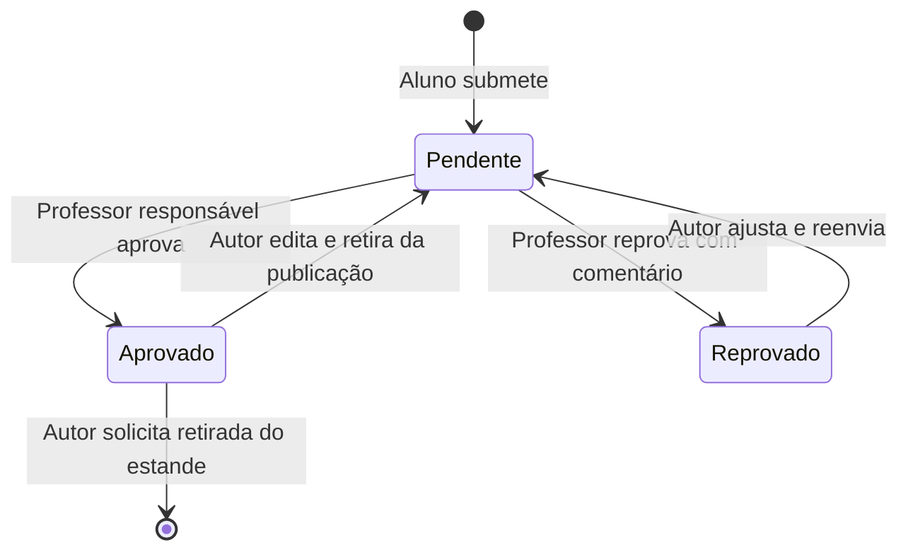

# Mostra+

Vitrine pública de projetos acadêmicos com curadoria docente. Visitantes exploram projetos publicados; alunos submetem e
acompanham seus trabalhos; professores avaliam os projetos atribuídos a eles.

Este repositório contém a base de uma aplicação Java 21 com Spring Boot e Maven. **As funcionalidades de negócio ainda
estão planejadas:** 

## Ciclo de vida

Somente projetos aprovados e não retirados são públicos. O reenvio mantém o professor responsável; o histórico de
avaliações e reenvios deve ser preservado. A retirada do estande tem efeito imediato; a política de exclusão física ou
lógica e retenção de dados ainda precisa de decisão.

## Stack

| Componente                              | Uso e estado atual                                                                                              |
|-----------------------------------------|-----------------------------------------------------------------------------------------------------------------|
| Java 21 e Maven Wrapper                 | Linguagem e build do projeto.                                                                                   |
| Spring Boot                             | POM declara versão 4.1.1; validar resolução e compatibilidade no marco de fundação.                             |
| Spring Web / MVC                        | Starter presente; endpoints de negócio pendentes.                                                               |
| Spring Data JPA e PostgreSQL Driver     | Dependências presentes; modelo e datasource pendentes.                                                          |
| Spring Security e Validation            | Dependências presentes; regras de autenticação, autorização e validação pendentes.                              |
| Flyway e suporte PostgreSQL             | Dependências presentes; migrations pendentes.                                                                   |
| Actuator                                | Dependência presente; política de exposição e monitoramento pendente.                                           |
| Spring Boot Test e Spring Security Test | Suporte por starters modulares de testes no POM; banco isolado e cenários pendentes.                            |
| springdoc / OpenAPI UI                  | POM declara 3.1.0; contratos de negócio pendentes.                                                              |
| Brevo                                   | Serviço de envio de e-mail escolhido; integração e eventos ainda serão definidos. REST client já consta no POM. |

## Execução local

