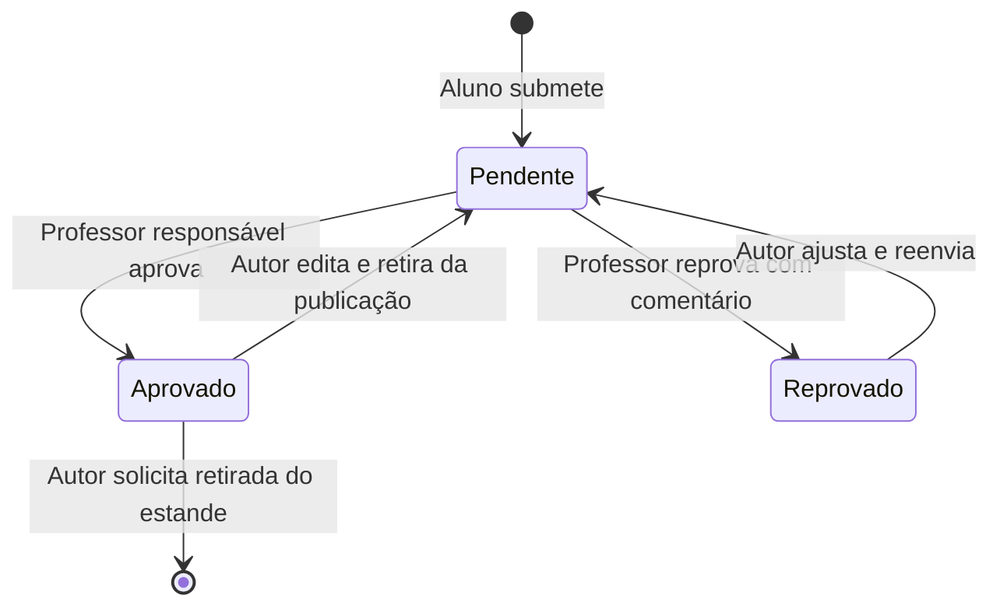

# Mostra+

Vitrine pública de projetos acadêmicos com curadoria docente. Visitantes exploram projetos publicados; alunos submetem e acompanham seus trabalhos; professores avaliam os projetos atribuídos a eles.

Este repositório contém a base de uma aplicação Java 21 com Spring Boot e Maven. **As funcionalidades de negócio ainda estão planejadas:** o código atual contém a classe de inicialização, um teste de contexto e a configuração do nome da aplicação. Não há controllers de negócio, entidades, migrations, interface ou integração Brevo implementados.

## Documentação e planejamento

- [Análise de requisitos](docs/Analise_de_Requisitos_Mostra%2B.docx): perfis, regras, RF01–RF40, RNF01–RNF15 e critérios CA01–CA13.
- [Arquitetura e fluxo](docs/Documento%20de%20Arquitetura%20e%20Fluxo%202%20%281%29.pdf): autorização, armazenamento e ciclo de vida.
- [Plano de desenvolvimento](docs/PLANEJAMENTO.md): 6 marcos, 26 issues, dependências e critérios de aceite.
- [Backlog estruturado](docs/planejamento-github.json): conteúdo publicado, com números e links do GitHub.
- [Guia para agentes e contribuidores](AGENTS.md).
- [Issues no GitHub](https://github.com/DelsonAaFilho/A3_Web/issues) e [milestones](https://github.com/DelsonAaFilho/A3_Web/milestones).

O planejamento está publicado no GitHub: **6 milestones e 26 issues**, com dependências e critérios de aceite. O plano relaciona cada identificador local ao número e link da issue correspondente.

## Perfis e funcionalidades previstas

| Perfil | Capacidades |
| --- | --- |
| Visitante | Consultar projetos aprovados, pesquisar, filtrar por categoria e navegar com paginação numérica. |
| Aluno | Cadastrar projetos, acompanhar status/comentários, reenviar reprovados, editar aprovados e retirá-los do estande quando for o autor. |
| Professor | Consultar e avaliar somente projetos atribuídos, aprovando ou reprovando com justificativa. |

Cadastro e login usam nome, e-mail, senha e perfil aluno/professor. As permissões devem ser aplicadas no servidor. A tecnologia da interface e a estratégia de sessão serão definidas no primeiro marco.

## Ciclo de vida



Somente projetos aprovados e não retirados são públicos. O reenvio mantém o professor responsável; o histórico de avaliações e reenvios deve ser preservado. A retirada do estande tem efeito imediato; a política de exclusão física ou lógica e retenção de dados ainda precisa de decisão.

## Regras principais

- Título obrigatório com até 100 caracteres e descrição obrigatória com até 500.
- Ao menos um participante; categoria, site, e-mail de contato e professor responsável obrigatórios.
- Categorias: Educação, Saúde, Negócios, Produtividade, Viagens, Cotidiano, Acessibilidade, Automação e IA.
- Professor e categoria escolhidos em listas; IDs validados no backend.
- Logo opcional e até 3 imagens opcionais, nos formatos JPG, PNG ou WebP, com até 2 MB por arquivo.
- LinkedIn e GitHub opcionais. Aplicativos devem informar página de download, sem link direto para executável.
- Nomes e e-mail de contato serão públicos; o formulário deve informar isso e coletar ciência do aluno.
- Interface e mensagens em português do Brasil, com responsividade, acessibilidade e paginação numérica.

## Stack

| Componente | Uso e estado atual |
| --- | --- |
| Java 21 e Maven Wrapper | Linguagem e build do projeto. |
| Spring Boot | POM declara versão 4.1.1; validar resolução e compatibilidade no marco de fundação. |
| Spring Web / MVC | Starter presente; endpoints de negócio pendentes. |
| Spring Data JPA e PostgreSQL Driver | Dependências presentes; modelo e datasource pendentes. |
| Spring Security e Validation | Dependências presentes; regras de autenticação, autorização e validação pendentes. |
| Flyway e suporte PostgreSQL | Dependências presentes; migrations pendentes. |
| Actuator | Dependência presente; política de exposição e monitoramento pendente. |
| Spring Boot Test e Spring Security Test | Suporte por starters modulares de testes no POM; banco isolado e cenários pendentes. |
| springdoc / OpenAPI UI | POM declara 3.1.0; contratos de negócio pendentes. |
| Brevo | Serviço de envio de e-mail escolhido; integração e eventos ainda serão definidos. REST client já consta no POM. |

O POM também contém DevTools, Lombok e Spring REST Docs/Asciidoctor. As versões declaradas descrevem o arquivo atual; não representam uma matriz de compatibilidade já validada. Metadados ficam no PostgreSQL; imagens devem ficar em storage separado, cujo provedor ainda não foi escolhido.

## Execução local

Pré-requisitos: JDK 21, acesso para baixar a distribuição Maven/dependências e uma instância PostgreSQL acessível. A versão de PostgreSQL suportada será fixada no marco de fundação. Não há Docker Compose ou provisionamento de banco neste momento.

Crie um banco e um usuário locais. Configure o terminal com valores do seu ambiente, sem adicionar credenciais a arquivos versionados:

```bash
export SPRING_DATASOURCE_URL='jdbc:postgresql://localhost:5432/mostra_plus'
export SPRING_DATASOURCE_USERNAME='seu_usuario_local'
read -rs 'SPRING_DATASOURCE_PASSWORD?Senha do PostgreSQL: '
export SPRING_DATASOURCE_PASSWORD
./mvnw spring-boot:run
```

O exemplo de leitura de senha usa zsh. Em outros shells, configure a variável de senha pelo mecanismo seguro do seu ambiente. No Windows, use `mvnw.cmd` e a sintaxe de variáveis do seu terminal.

`application.properties` contém apenas `spring.application.name=a3Work`. Não existe configuração de segurança personalizada: iniciar a base não disponibiliza as jornadas descritas acima. PostgreSQL e Flyway precisam de configuração válida para a inicialização e para o teste de contexto.

As variáveis específicas de Brevo, remetente, templates e storage serão documentadas quando suas integrações forem implementadas; ainda não há nomes de propriedades vinculados no código. Nunca versionar chaves de API ou senhas.

## Testes e build

```bash
./mvnw test
./mvnw -Dtest=A3WorkApplicationTests test
./mvnw clean verify
```

O último comando também inclui o processamento de documentação configurado no POM. O teste de contexto atual depende da configuração do banco; o backlog prevê PostgreSQL isolado e CI. Na verificação de 05/10/2026, `./mvnw test` chegou à execução do teste, mas `contextLoads` falhou por datasource não configurado (`Failed to determine a suitable driver class`): 1 teste, 1 erro. Não use banco de produção nem envio real de e-mails nos testes.

## Estrutura

```text
docs/                                  Requisitos, arquitetura e planejamento
src/main/java/com/example/a3work/       Código da aplicação
src/main/resources/application.properties
src/test/java/com/example/a3work/       Testes
pom.xml                                Dependências e plugins
.mvn/ e mvnw*                          Maven Wrapper
```

As futuras migrations devem ficar em `src/main/resources/db/migration/`, com nomes como `V1__create_users.sql`.

## Ordem de entrega

1. Requisitos e decisões de arquitetura.
2. Fundação técnica, persistência e CI.
3. Identidade, autorização e submissão.
4. Curadoria e ciclo de vida.
5. Vitrine, interface, e-mails e contratos OpenAPI.
6. Homologação, operação e entrega.

Desenvolva cada funcionalidade com testes e revisão por pull request. Consulte os critérios de saída e as dependências no plano antes de iniciar uma issue. Datas e responsáveis serão definidos pela equipe.
