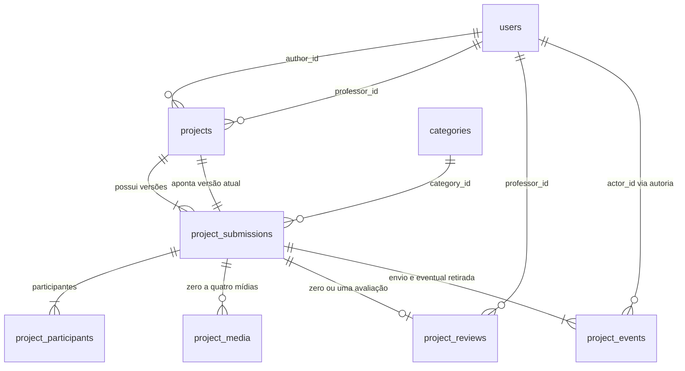

# Modelo de banco de dados — Mostra+

**Status:** proposta técnica, elaborada em 05/10/2026. O projeto ainda não possui entidades de negócio nem migrations. Este documento especifica o modelo; o SQL abaixo não foi instalado no banco da aplicação.

## 1. Escopo e fontes

O modelo cobre contas, categorias, projetos, versões submetidas, participantes, mídias, avaliações e histórico de submissão/retirada. Usa PostgreSQL, com persistência prevista por Spring Data JPA e evolução por Flyway.

Fontes de negócio:

- [Análise de requisitos](Analise_de_Requisitos_Mostra%2B.docx), especialmente RN01–22, RNF09, RNF13–15 e seção 8.
- [Arquitetura e fluxo](Documento%20de%20Arquitetura%20e%20Fluxo%202%20%281%29.pdf).
- [Planejamento](PLANEJAMENTO.md), especialmente DEC-01, DEC-02, DEC-03, TEC-02, MEDIA-01 e FLOW-01–04.
- [Diretrizes do repositório](../AGENTS.md).

Há **8 tabelas de domínio**. Visitante é uma condição de acesso sem autenticação, portanto não é uma conta nem uma tabela. Participantes são nomes informados no projeto, sem exigência de cadastro. Logo e imagens ficam no storage; o banco guarda suas referências.

### Decisões técnicas propostas e pendências

As escolhas abaixo tornam o modelo concreto, mas não encerram as decisões de produto do planejamento.

| Tema | Proposta neste documento | Situação |
| --- | --- | --- |
| Histórico de conteúdo | Cada envio cria uma versão imutável, com seus participantes e referências de mídia. | Escolha técnica para identificar exatamente o conteúdo avaliado; não cria uma função de restauração de versões. |
| Retirada da vitrine | `withdrawn_at` retira imediatamente o projeto das consultas públicas. | Retenção, anonimização e exclusão física continuam pendentes em DEC-01. Não se define retenção permanente. |
| Edição de pendente | Nenhuma transição de edição de pendente é definida aqui. | DEC-01. |
| Perfil docente | A conta possui um único perfil, aluno ou professor. | Validação institucional da escolha continua em DEC-01; professor não ganha permissão para submeter. |
| Sessão | O modelo de domínio independe de cookies ou tokens. | DEC-02; nenhuma tabela de sessão/token é inventada. |
| Storage | Namespace e chave opacos, sem fornecedor específico. | Provedor, entrega de mídia e política de cache em DEC-02. |
| E-mail Brevo | Nenhuma tabela de envio faz parte do núcleo. | Eventos, destinatários e necessidade de outbox em DEC-03. |
| Limite de upload | O SQL usa **2.000.000 bytes** para “2 MB”. | Convenção técnica proposta; confirmar antes da migration caso a equipe prefira 2 MiB. |
| Limites não especificados | Nome: 150; URL: 2048; texto alternativo: 300 caracteres. | Limites técnicos propostos, não requisitos originais. |
| Busca e ordenação | Exemplo ordena por publicação e ID. | Campos pesquisáveis, tamanho de página e ordenação final em DEC-02. |
| Ciência de publicação | Preservar texto, versão do aviso e instante da ciência do autor junto ao envio. | Quando exigir nova ciência em uma revisão continua a ser definido; não equivale a consentimento de todos os participantes. |

Não se acrescentam perfis de administrador, recuperação de senha, verificação de e-mail, curtidas, notas, comentários públicos ou cadastro de instituições.

## 2. Convenções, IDs e tipos

- Tabelas/colunas em inglês e `snake_case`; textos e interface em pt-BR.
- PK significa chave primária; FK, chave estrangeira; UQ, unicidade; NN, `NOT NULL`.
- `bigint GENERATED ALWAYS AS IDENTITY` gera IDs positivos no banco. A PK garante unicidade. Não gerar IDs com `MAX(id) + 1`.
- Cada coluna identity possui uma sequence administrada pelo PostgreSQL. Lacunas após rollback são normais. Não há exigência de numeração contínua.
- A versão submetida usa PK composta `(project_id, submission_no)`. `submission_no` começa em 1 e cresce sob bloqueio do projeto; não é uma sequence global.
- `projects.version` é a versão de concorrência otimista do JPA, distinta de `submission_no`.
- Datas usam `timestamptz`, mapeadas para `Instant`, e são apresentadas em JSON em UTC. O banco não preserva o nome original de um fuso horário.
- Valores de enum usam `varchar` com `CHECK`, e `EnumType.STRING` no JPA. Não persistir o ordinal do enum.
- `NULL` representa campos opcionais ausentes. A aplicação converte strings opcionais vazias em `NULL` antes de persistir.
- `created_at`, `submitted_at`, `reviewed_at` e `occurred_at` recebem `CURRENT_TIMESTAMP` quando omitidos. `updated_at` deve ser atualizado explicitamente pelo serviço/JPA; o default só atua no INSERT.
- Todas as FKs abaixo usam `ON DELETE RESTRICT ON UPDATE RESTRICT`. A exceção é a referência circular à versão atual, que usa `NO ACTION` diferido na exclusão. Não há exclusão em cascata de histórico.

A geração por identity e sua sequence implícita seguem a [documentação do PostgreSQL](https://www.postgresql.org/docs/current/ddl-identity-columns.html). O mapeamento Java proposto usa [`GenerationType.IDENTITY`](https://jakarta.ee/specifications/persistence/3.2/apidocs/jakarta.persistence/jakarta/persistence/generationtype).

### Valores controlados

| Campo | Valores persistidos | Significado |
| --- | --- | --- |
| `users.role` | `STUDENT`, `PROFESSOR` | Aluno e professor. |
| `projects.status` | `PENDING`, `APPROVED`, `REJECTED` | Pendente, aprovado e reprovado. |
| `project_reviews.decision` | `APPROVED`, `REJECTED` | Resultado da avaliação. |
| `project_media.kind` | `LOGO`, `IMAGE` | Logo ou imagem de galeria. |
| `project_events.event_type` | `SUBMITTED`, `RESUBMITTED`, `EDITED_AFTER_APPROVAL`, `WITHDRAWN` | Eventos feitos pelo autor. Avaliações ficam em `project_reviews`. |

Retirada é representada por `withdrawn_at`, sem inventar um quarto status de avaliação. Um aprovado retirado continua com a última decisão registrada, mas não é público.

## 3. Diagrama de relacionamentos



A seta da versão atual é uma FK composta adicional: ela obriga a versão apontada a pertencer ao próprio projeto. As cardinalidades mínimas do diagrama descrevem o domínio; a seção 7 distingue o que o SQL garante do que o serviço precisa garantir.

## 4. Dicionário completo de dados

Em todas as tabelas abaixo, `—` em default significa que não há default: o valor é fornecido pela aplicação ou fica `NULL` se opcional. Todas as colunas estão listadas.

### 4.1. `UserRepository` — contas autenticáveis

| Coluna | Tipo SQL | Nulo? | Default | Chaves e regra |
| --- | --- | --- | --- | --- |
| `id` | `bigint` | Não | Identity | PK. |
| `name` | `varchar(150)` | Não | — | Nome não vazio. |
| `email` | `varchar(254)` | Não | — | UQ; armazenado com trim e minúsculas. |
| `password_hash` | `varchar(255)` | Não | — | Hash codificado com algoritmo/parâmetros/salt; nunca senha pura. |
| `role` | `varchar(16)` | Não | — | `STUDENT` ou `PROFESSOR`. |
| `created_at` | `timestamptz` | Não | `CURRENT_TIMESTAMP` | Criação. |
| `updated_at` | `timestamptz` | Não | `CURRENT_TIMESTAMP` | Última alteração. |

A normalização do e-mail é uma proposta de identificação de conta e deve ser igual no cadastro e no login. O e-mail de contato do projeto é independente. O perfil não é alterável por endpoints genéricos de atualização de conta. Não armazenar uma segunda coluna de salt quando ele já está incluído no formato produzido pelo `PasswordEncoder` escolhido.

### 4.2. `categories` — catálogo predefinido

| Coluna | Tipo SQL | Nulo? | Default | Chaves e regra |
| --- | --- | --- | --- | --- |
| `id` | `bigint` | Não | Identity | PK. |
| `code` | `varchar(32)` | Não | — | UQ; identificador estável sem acentos. |
| `name` | `varchar(60)` | Não | — | UQ; rótulo pt-BR não vazio. |
| `sort_order` | `smallint` | Não | — | UQ; positivo. |

| Ordem | `code` | `name` |
| --- | --- | --- |
| 1 | `EDUCATION` | Educação |
| 2 | `HEALTH` | Saúde |
| 3 | `BUSINESS` | Negócios |
| 4 | `PRODUCTIVITY` | Produtividade |
| 5 | `TRAVEL` | Viagens |
| 6 | `DAILY_LIFE` | Cotidiano |
| 7 | `ACCESSIBILITY` | Acessibilidade |
| 8 | `AUTOMATION` | Automação |
| 9 | `AI` | IA |

O seed resolve IDs automaticamente. Referenciar categorias por ID nas FKs e pelo código quando uma migration precisar localizá-las; não depender de IDs numéricos fixos. Não há CRUD público de categorias previsto.

### 4.3. `projects` — identidade, responsáveis e estado atual

| Coluna | Tipo SQL | Nulo? | Default | Chaves e regra |
| --- | --- | --- | --- | --- |
| `id` | `bigint` | Não | Identity | PK. |
| `author_id` | `bigint` | Não | — | FK → `users.id`; serviço exige aluno autenticado. |
| `professor_id` | `bigint` | Não | — | FK → `users.id`; serviço exige professor elegível. |
| `current_submission_no` | `integer` | Não | `1` | FK com `id` → versão do próprio projeto; positivo. |
| `status` | `varchar(16)` | Não | `'PENDING'` | Estado atual. |
| `published_at` | `timestamptz` | Sim | — | Publicação da versão atual; obrigatório apenas em aprovado. |
| `withdrawn_at` | `timestamptz` | Sim | — | Retirada da vitrine; permitido apenas em aprovado. |
| `created_at` | `timestamptz` | Não | `CURRENT_TIMESTAMP` | Primeiro cadastro. |
| `updated_at` | `timestamptz` | Não | `CURRENT_TIMESTAMP` | Última transição. |
| `version` | `bigint` | Não | `0` | `@Version`; não negativo. |

Autoria e professor são preservados nas revisões. UQs adicionais `(id, author_id)` e `(id, professor_id)` permitem FKs que garantem, respectivamente, o ator autor dos eventos e o professor responsável das avaliações. Autor e professor não podem ser a mesma conta.

### 4.4. `project_submissions` — conteúdo de cada envio

| Coluna | Tipo SQL | Nulo? | Default | Chaves e regra |
| --- | --- | --- | --- | --- |
| `project_id` | `bigint` | Não | — | PK composta; FK → `projects.id`. |
| `submission_no` | `integer` | Não | — | PK composta; positivo e sequencial por projeto no serviço. |
| `category_id` | `bigint` | Não | — | FK → `categories.id`. |
| `title` | `varchar(100)` | Não | — | Obrigatório, não vazio; RN14. |
| `description` | `varchar(500)` | Não | — | Obrigatória, não vazia; RN11. |
| `website_url` | `varchar(2048)` | Não | — | Site ou página de download; RN16. |
| `contact_email` | `varchar(254)` | Não | — | E-mail público de contato, não exclusivo. |
| `linkedin_url` | `varchar(2048)` | Sim | — | Link opcional. |
| `github_url` | `varchar(2048)` | Sim | — | Link opcional. |
| `publication_notice_version` | `varchar(32)` | Não | — | Versão do aviso apresentado ao autor. |
| `publication_notice_text` | `text` | Não | — | Texto efetivamente apresentado, não vazio. |
| `publication_acknowledged_at` | `timestamptz` | Não | — | Ciência do autor, registrada pelo servidor. |
| `submitted_at` | `timestamptz` | Não | `CURRENT_TIMESTAMP` | Data/hora do envio; não anterior à ciência. |

A autoria da ciência decorre de `projects.author_id`, que não muda. O texto e a versão do aviso vêm do servidor, não de um texto arbitrário enviado pelo cliente. Na primeira submissão, exigir ciência explícita. Uma revisão pode copiar a evidência anterior quando a política definida permitir; não atualizar artificialmente a data de uma ciência não renovada.

Versões já enviadas não recebem `UPDATE` no fluxo normal. Cada revisão copia o conteúdo mantido, aplica alterações e cria novas linhas de participantes e mídias. Não há armazenamento de rascunho neste modelo. Título, descrição, contatos e links históricos ficam identificados pela versão; nomes atuais de categoria e professor continuam sendo referências de catálogo/conta, sem promessa de fotografia histórica desses rótulos.

### 4.5. `project_participants` — nomes por versão

| Coluna | Tipo SQL | Nulo? | Default | Chaves e regra |
| --- | --- | --- | --- | --- |
| `id` | `bigint` | Não | Identity | PK. |
| `project_id` | `bigint` | Não | — | FK composta com `submission_no`. |
| `submission_no` | `integer` | Não | — | FK → `project_submissions`. |
| `name` | `varchar(150)` | Não | — | Nome não vazio. |
| `position` | `integer` | Não | — | Positivo; UQ por versão. |

Exigir pelo menos um participante no serviço antes do commit. Nomes iguais não são proibidos: pessoas diferentes podem ter o mesmo nome. Não existe `user_id`, pois a fonte exige lista de nomes, não coautoria com contas. Estar nesta lista não concede permissão de edição.

### 4.6. `project_media` — logo e imagens por versão

| Coluna | Tipo SQL | Nulo? | Default | Chaves e regra |
| --- | --- | --- | --- | --- |
| `id` | `bigint` | Não | Identity | PK. |
| `project_id` | `bigint` | Não | — | FK composta com `submission_no`. |
| `submission_no` | `integer` | Não | — | FK → `project_submissions`. |
| `kind` | `varchar(8)` | Não | — | `LOGO` ou `IMAGE`. |
| `position` | `smallint` | Não | — | Logo: `0`; imagem: `1`, `2` ou `3`. |
| `storage_namespace` | `varchar(255)` | Não | — | Local lógico/bucket/container, conforme adaptador. |
| `storage_key` | `varchar(512)` | Não | — | Chave de objeto gerada pelo servidor. |
| `content_type` | `varchar(32)` | Não | — | `image/jpeg`, `image/png` ou `image/webp`. |
| `size_bytes` | `integer` | Não | — | De 1 a 2.000.000 bytes, conforme convenção proposta. |
| `alt_text` | `varchar(300)` | Não | — | Descrição acessível não vazia. |
| `created_at` | `timestamptz` | Não | `CURRENT_TIMESTAMP` | Criação da referência. |

A UQ `(project_id, submission_no, kind, position)` e o `CHECK` de posição limitam cada versão a um logo e três imagens, inclusive sob concorrência. Outra UQ impede repetir o mesmo objeto na mesma versão. Um objeto pode ser reutilizado por várias versões; sua exclusão precisa verificar **todas** as referências remanescentes.

Não guardar binários, base64, URL assinada temporária ou credenciais de storage. Tipo e tamanho são metadados verificados pelo backend a partir do arquivo real. Uma versão antiga nunca é exposta publicamente só porque o projeto atual está aprovado. Objetos usados por versões atuais públicas podem ser servidos somente nesse contexto autorizado.

### 4.7. `project_reviews` — avaliações preservadas

| Coluna | Tipo SQL | Nulo? | Default | Chaves e regra |
| --- | --- | --- | --- | --- |
| `id` | `bigint` | Não | Identity | PK. |
| `project_id` | `bigint` | Não | — | FK com `submission_no`; FK com `professor_id`. |
| `submission_no` | `integer` | Não | — | FK → versão avaliada; UQ com `project_id`. |
| `professor_id` | `bigint` | Não | — | FK composta → `(projects.id, projects.professor_id)`. |
| `decision` | `varchar(16)` | Não | — | `APPROVED` ou `REJECTED`. |
| `comment` | `text` | Sim | — | Obrigatório e não vazio na reprovação. |
| `reviewed_at` | `timestamptz` | Não | `CURRENT_TIMESTAMP` | Momento da decisão. |

Cada versão recebe no máximo uma avaliação. Uma nova decisão depende de nova submissão; nunca sobrescrever a reprovação anterior. O comentário da aprovação pode ser `NULL`. O limite operacional de tamanho da requisição/comentário será definido no contrato, sem inventar limite de negócio no banco.

### 4.8. `project_events` — submissões, reenvios e retiradas

| Coluna | Tipo SQL | Nulo? | Default | Chaves e regra |
| --- | --- | --- | --- | --- |
| `id` | `bigint` | Não | Identity | PK. |
| `project_id` | `bigint` | Não | — | FK com `submission_no`; FK com `actor_id`. |
| `submission_no` | `integer` | Não | — | FK → versão enviada ou retirada. |
| `actor_id` | `bigint` | Não | — | FK composta → `(projects.id, projects.author_id)`. |
| `event_type` | `varchar(32)` | Não | — | Um dos quatro eventos do autor. |
| `from_status` | `varchar(16)` | Sim | — | `NULL` somente no primeiro envio. |
| `to_status` | `varchar(16)` | Não | — | Estado após o evento. |
| `occurred_at` | `timestamptz` | Não | `CURRENT_TIMESTAMP` | Data/hora do evento. |

UQ `(project_id, submission_no, event_type)` impede duplicar o mesmo tipo de evento na mesma versão. `SUBMITTED` é exclusivo da versão 1; `RESUBMITTED` e `EDITED_AFTER_APPROVAL` exigem versão maior que 1. Na retirada, origem e destino são `APPROVED`; o efeito é preencher `withdrawn_at`.

A linha do tempo privada combina esta tabela com `project_reviews`; não duplicar avaliações como eventos com outro texto de comentário. A mesma transação grava a mudança de estado e seu registro histórico.

## 5. Todas as chaves estrangeiras

| Nome da FK | Origem | Destino | Exclusão / atualização |
| --- | --- | --- | --- |
| `fk_projects_author` | `projects.author_id` | `users.id` | RESTRICT / RESTRICT |
| `fk_projects_professor` | `projects.professor_id` | `users.id` | RESTRICT / RESTRICT |
| `fk_projects_current_submission` | `projects.(id, current_submission_no)` | `project_submissions.(project_id, submission_no)` | NO ACTION diferido / RESTRICT |
| `fk_submissions_project` | `project_submissions.project_id` | `projects.id` | RESTRICT / RESTRICT |
| `fk_submissions_category` | `project_submissions.category_id` | `categories.id` | RESTRICT / RESTRICT |
| `fk_participants_submission` | `project_participants.(project_id, submission_no)` | `project_submissions.(project_id, submission_no)` | RESTRICT / RESTRICT |
| `fk_media_submission` | `project_media.(project_id, submission_no)` | `project_submissions.(project_id, submission_no)` | RESTRICT / RESTRICT |
| `fk_reviews_submission` | `project_reviews.(project_id, submission_no)` | `project_submissions.(project_id, submission_no)` | RESTRICT / RESTRICT |
| `fk_reviews_assigned_professor` | `project_reviews.(project_id, professor_id)` | `projects.(id, professor_id)` | RESTRICT / RESTRICT |
| `fk_events_submission` | `project_events.(project_id, submission_no)` | `project_submissions.(project_id, submission_no)` | RESTRICT / RESTRICT |
| `fk_events_author` | `project_events.(project_id, actor_id)` | `projects.(id, author_id)` | RESTRICT / RESTRICT |

Não é necessário repetir uma FK direta a `UserRepository` nos registros de avaliação/evento: as FKs compostas passam por um projeto que já referencia a conta. Elas também impedem atribuir a avaliação a outro professor ou o evento a outro autor.

## 6. Ciclo de vida e transações

| Ação | Ator | Origem → destino | Gravações na mesma transação |
| --- | --- | --- | --- |
| Enviar projeto | Aluno autenticado | Novo → `PENDING` | Projeto, versão 1, participantes, mídias opcionais e `SUBMITTED`. |
| Aprovar | Professor atribuído | `PENDING` → `APPROVED` | Avaliação da versão atual; definir `published_at`. |
| Reprovar | Professor atribuído | `PENDING` → `REJECTED` | Avaliação com comentário; `published_at = NULL`. |
| Corrigir e reenviar | Autor | `REJECTED` → `PENDING` | Nova versão e seus filhos; mover referência atual; `RESUBMITTED`. |
| Editar aprovado | Autor | `APPROVED` → `PENDING` | Nova versão e seus filhos; retirar publicação na mesma transação; `EDITED_AFTER_APPROVAL`. |
| Retirar do estande | Autor | `APPROVED` → `APPROVED` retirado | Preencher `withdrawn_at`; `WITHDRAWN`; não criar nova versão. |

Todas as ações em projeto existente exigem `withdrawn_at IS NULL`; não há restauração ou nova edição de retirado definida. Repetir uma retirada já concluída pelo autor pode retornar sucesso sem criar outro evento, conforme contrato a formalizar em DEC-02. Não reabrir o projeto silenciosamente.

### Concorrência

1. Abrir transação no serviço e carregar o projeto com `SELECT ... FOR UPDATE` (JPA: `PESSIMISTIC_WRITE`). Usar sempre a mesma ordem de bloqueio quando houver mais de um registro.
2. Conferir identidade autenticada, vínculo, estado, ausência de retirada e número de submissão esperado pelo cliente. Uma decisão enviada para a versão 1 não pode ser aplicada à versão 2.
3. Para revisão, calcular `current_submission_no + 1` **sob o bloqueio**, inserir versão e filhos e só então alterar a referência atual. Preservar autor e professor.
4. Persistir avaliação/evento e atualizar estado, timestamps e `@Version`. Qualquer falha faz rollback de todo o conjunto.
5. Publicar o resultado após commit. Não manter transação/bloqueio aberto durante upload ou chamada ao Brevo.

`READ COMMITTED` com esse bloqueio por projeto é a estratégia proposta; não é necessário escolher `SERIALIZABLE` globalmente. `@Version` protege atualizações ORM que escapem do fluxo bloqueado, mas não substitui as checagens de autorização. SQL de atualização em lote precisa incluir e incrementar a versão explicitamente ou ser evitado.

Na primeira criação, persistir projeto e versão 1 na mesma transação. A FK da versão atual é `DEFERRABLE INITIALLY DEFERRED`, permitindo obter o ID do projeto antes de inserir sua primeira versão. No commit, a referência precisa existir.

### Visibilidade pública

O predicado obrigatório é:

```sql
p.status = 'APPROVED' AND p.withdrawn_at IS NULL
```

Aplicar também no detalhe, contagem, busca, filtros e resolução de mídia. Carregar somente `s.submission_no = p.current_submission_no`. Histórico e comentários nunca compõem o DTO público. A retirada/edição deve invalidar caches e impedir acesso direto a mídias privadas; uma FK não resolve controle de acesso no storage.

## 7. Garantias do banco e responsabilidades do serviço

O DDL da seção 10 implementa PKs, FKs, UQs, limites de coluna e `CHECK`s locais. Ele **não implementa sozinho** o fluxo de negócio completo.

| Regra | Garantia no SQL de referência | Responsabilidade adicional |
| --- | --- | --- |
| E-mail de conta único | UQ e normalização verificada. | Validar formato e aplicar normalização no login. |
| Autor aluno / responsável professor | FKs garantem existência; `CHECK` impede mesma conta. | Conferir os perfis e impedir mudança de perfil que invalide vínculos. |
| Avaliador é o professor atribuído | FK composta. | Conferir que o principal autenticado é esse professor. |
| Ator de envio/retirada é o autor | FK composta. | Derivar ator da autenticação, nunca aceitar autoridade do payload. |
| Uma avaliação por versão | UQ. | Exigir versão atual pendente e impedir avaliação de versão antiga. |
| Comentário na reprovação | `CHECK` não vazio. | Mensagem de validação em pt-BR. |
| Pelo menos um participante | Não garantido por FK/`CHECK` simples. | Validar coleção na mesma transação antes de persistir/commit. |
| Máximo de 3 imagens e 1 logo | Slots permitidos e UQ por versão. | Verificar arquivo real, autorização e integridade no storage. |
| URLs e contato válidos | Campos obrigatórios não vazios. | Validar e-mail, esquemas HTTP(S), URLs opcionais e rejeitar link direto de executável. |
| Estado coerente com avaliação/histórico | `CHECK`s locais de status e timestamps. | Atualizar tudo atomicamente, sem alterar estado por CRUD genérico. |
| Versões sequenciais e histórico imutável | PK/UQ evitam colisões, não garantem sequência ou imutabilidade. | Bloqueio, incremento e proibição de update/delete de versões/histórico no fluxo normal. |
| Ciência antes de enviar | Campos NN e ordem dos timestamps. | Exigir ação explícita e usar aviso oficial do servidor. |
| Publicar só versão atual aprovada | Índices ajudam consulta; não concedem/restringem acesso. | Aplicar predicado e autorização em todas as leituras. |

Não usar subqueries em `CHECK` para contar participantes ou verificar perfis em outra tabela. Restrições entre linhas exigem outro mecanismo, conforme a [documentação de constraints do PostgreSQL](https://www.postgresql.org/docs/current/ddl-constraints.html). Se a implementação permitir gravadores além do serviço, acrescentar procedures/triggers transacionais ou restringir esses gravadores; o SQL apresentado não inclui triggers nem políticas RLS.

Recomenda-se separar o usuário de migrations do usuário da aplicação. Este último terá leitura e inserção no histórico, sem update/delete de versões, participantes, mídias, avaliações e eventos. A eliminação futura será um fluxo operacional específico, após DEC-01, sem `CascadeType.REMOVE` amplo.

## 8. JPA, serialização e desserialização

### Mapeamento relacional Java

| SQL / tabela | Tipo/entidade Java proposto | Mapeamento |
| --- | --- | --- |
| `bigint` identity | `Long` | `@Id` e `@GeneratedValue(strategy = GenerationType.IDENTITY)`. |
| `integer` / `smallint` | `Integer` / `Short` | Limites e nulabilidade coerentes com o DDL. |
| `timestamptz` | `Instant` | Entrada/saída UTC. |
| `varchar` / `text` | `String` | Comprimento de coluna/validação correspondentes; não usar `@Lob` para induzir OID PostgreSQL. |
| `UserRepository` | `User` | `role` como enum string; hash exclusivo do modelo interno. |
| `categories` | `Category` | Catálogo somente leitura no fluxo da aplicação. |
| `projects` | `Project` | Duas associações `@ManyToOne(fetch = LAZY)` a `User`; `@Version Long version`. |
| `project_submissions` | `ProjectSubmission` | `@EmbeddedId ProjectSubmissionId(projectId, submissionNo)`; projeto via `@MapsId("projectId")`; categoria `ManyToOne`. |
| `project_participants` | `ProjectParticipant` | `ManyToOne` à submissão por `@JoinColumns`; ordenar por `position`. |
| `project_media` | `ProjectMedia` | `ManyToOne` à submissão por `@JoinColumns`; ordenar por `kind` e `position`. |
| `project_reviews` | `ProjectReview` | Associação à submissão; UQ garante no máximo uma avaliação; professor por ID/associação. |
| `project_events` | `ProjectEvent` | Associação à submissão e ator; enum string. |

Manter `currentSubmissionNo` como campo persistente em `Project`. Se houver associação de navegação `currentSubmission`, mapeá-la com joins `(id, current_submission_no)` somente leitura (`insertable = false, updatable = false`) para evitar dois escritores da mesma coluna. FKs compostas de autoria/atribuição permanecem sob controle da migration, mesmo quando a associação Java com `User` usa apenas seu ID.

O objeto de PK composta deve ter `equals`/`hashCode` coerentes e pode implementar `Serializable` com `serialVersionUID = 1L`. Esse identificador de serialização Java **não é uma coluna**, uma chave do banco ou a versão de negócio. Não guardar objetos Java serializados em `bytea` para representar entidades.

Evitar `@Data` nas entidades com associações bidirecionais. Não incluir coleções, hashes ou associações lazy em `toString`, `equals` e `hashCode`. Preferir DTOs construídos dentro da transação e consultas com projeções/join fetch controlados; a configuração atual já desativa Open Session in View.

### Contrato JSON proposto

Contratos são propostas para DEC-02, não endpoints já implementados.

- JSON usa `camelCase`. Identificadores `bigint` e `version` são strings decimais para não perder precisão em clientes JavaScript. `submissionNo`, posições e quantidades são números.
- Datas são strings ISO 8601, por exemplo `2026-10-05T15:30:00Z`.
- Enums usam os códigos estáveis acima; a interface traduz os rótulos para pt-BR.
- Opcionais ausentes são `null`; coleções vazias são `[]`. Não serializar proxies JPA ou entidades completas.
- Na criação, o cliente informa conteúdo, participantes, `categoryId`, `professorId` e ciência. IDs de objetos de upload, se utilizados, devem estar vinculados ao autor e ser verificados no servidor.
- O cliente não define `authorId`, hash, status, versão atual, datas de auditoria ou caminhos de storage. Revisões recebem versão/submissão esperada apenas como precondição de concorrência; o servidor calcula os novos valores.
- Avaliação aceita decisão, comentário e submissão esperada; o professor vem da autenticação. A retirada identifica o projeto, mas o ator também vem da autenticação.
- Rejeitar propriedades protegidas no DTO de entrada. A validação de ID existente não substitui a checagem de permissão.

| DTO | Campos permitidos na saída |
| --- | --- |
| Conta própria | `id`, `name`, `email`, `role`; nunca `passwordHash`. |
| Categoria | `id`, `code`, `name`. |
| Professor para seleção | `id`, `name`; sem e-mail de login. |
| Cartão público | `id`, `title`, `category`, `logo`. |
| Detalhe público | Cartão, `description`, `participants`, `images`, `websiteUrl`, `contactEmail`, `linkedinUrl`, `githubUrl`, professor (`id`, `name`). |
| Acompanhamento privado | Detalhe, `status`, `currentSubmissionNo`, `version`, datas de submissão/publicação/retirada e histórico autorizado. |
| Avaliação privada | `id`, `submissionNo`, professor, `decision`, `comment`, `reviewedAt`. |
| Evento privado | `id`, `submissionNo`, ator, `eventType`, `fromStatus`, `toStatus`, `occurredAt`. |

Mídias saem como `{id, url, altText, position}`, com URL obtida do mecanismo de entrega autorizado. Nunca expor `storageNamespace`, `storageKey`, senha/hash, evidência de ciência ou histórico nos DTOs públicos.

Exemplo de detalhe público, com dados fictícios:

```json
{
  "id": "42",
  "title": "Guia acessível do campus",
  "description": "Mapa com rotas acessíveis e informações dos espaços acadêmicos.",
  "category": {"id": "7", "code": "ACCESSIBILITY", "name": "Acessibilidade"},
  "participants": [{"name": "Ana Exemplo", "position": 1}],
  "professor": {"id": "8", "name": "Professor Exemplo"},
  "websiteUrl": "https://example.org/projeto",
  "contactEmail": "contato@example.org",
  "linkedinUrl": null,
  "githubUrl": null,
  "logo": null,
  "images": []
}
```

## 9. Índices e consultas

As PKs e UQs criam índices próprios. As FKs não criam automaticamente um índice na tabela que referencia; os índices explícitos estão no SQL abaixo.

| Índice adicional | Finalidade |
| --- | --- |
| `ix_users_role_name` | Lista de professores por perfil e nome. |
| `ix_projects_author_status` | Meus projetos do aluno por estado/retirada. |
| `ix_projects_professor_status` | Fila e projetos do professor. |
| `ix_projects_public` | Vitrine por publicação, apenas aprovados não retirados. |
| `ix_submissions_category` | Filtro por categoria e apoio à FK. |
| `ix_reviews_assigned_professor` | Apoio à FK composta da avaliação. |
| `ix_events_author` | Apoio à FK composta do evento. |
| `ix_media_storage_object` | Localizar todas as referências antes de remover um objeto. |

PKs/UQs de submissões, participantes, mídias, avaliações e eventos já começam por `(project_id, submission_no)`; não criar índices idênticos redundantes. O índice parcial de vitrine não acelera sozinho pesquisa textual. Escolher GIN/trigram/full-text apenas após definir busca, idioma e medir consultas em DEC-02.

Exemplo de seleção da página pública (parâmetros nomeados para uso pela aplicação):

```sql
SELECT p.id, s.title, c.id AS category_id, c.name AS category_name
FROM projects p
JOIN project_submissions s
  ON s.project_id = p.id AND s.submission_no = p.current_submission_no
JOIN categories c ON c.id = s.category_id
WHERE p.status = 'APPROVED'
  AND p.withdrawn_at IS NULL
ORDER BY p.published_at DESC, p.id DESC
LIMIT :page_size OFFSET :offset;
```

Calcular `offset = (page_number - 1) * page_size`, com página e tamanho validados. O `COUNT` usa os mesmos filtros da listagem. Aplicar filtros opcionais por parâmetros; nunca concatenar texto fornecido pelo usuário ao SQL. Buscar a página de projetos antes de carregar coleções para não paginar linhas multiplicadas pelos participantes/mídias. O desempate por ID mantém ordem determinística, mas mudanças concorrentes podem deslocar resultados entre páginas.

## 10. DDL PostgreSQL de referência

Este bloco define o esquema físico proposto e o seed das categorias, em um banco/schema vazio. Não é uma migration instalada nem um script de atualização de banco existente. O `search_path` deve apontar para o schema da aplicação (por exemplo, `public`). Executar somente em ambiente isolado durante a validação. As regras da seção 7 atribuídas ao serviço continuam necessárias.

```sql
BEGIN;

CREATE TABLE users (
    id bigint GENERATED ALWAYS AS IDENTITY PRIMARY KEY,
    name varchar(150) NOT NULL CHECK (name ~ '[^[:space:]]'),
    email varchar(254) NOT NULL,
    password_hash varchar(255) NOT NULL CHECK (password_hash ~ '[^[:space:]]'),
    role varchar(16) NOT NULL CHECK (role IN ('STUDENT', 'PROFESSOR')),
    created_at timestamptz NOT NULL DEFAULT CURRENT_TIMESTAMP,
    updated_at timestamptz NOT NULL DEFAULT CURRENT_TIMESTAMP,
    CONSTRAINT uq_users_email UNIQUE (email),
    CONSTRAINT ck_users_email CHECK (
        email = lower(btrim(email)) AND email ~ '[^[:space:]]'
    ),
    CONSTRAINT ck_users_timestamps CHECK (updated_at >= created_at)
);

CREATE TABLE categories (
    id bigint GENERATED ALWAYS AS IDENTITY PRIMARY KEY,
    code varchar(32) NOT NULL UNIQUE CHECK (code ~ '^[A-Z][A-Z_]*$'),
    name varchar(60) NOT NULL UNIQUE CHECK (name ~ '[^[:space:]]'),
    sort_order smallint NOT NULL UNIQUE CHECK (sort_order > 0)
);

CREATE TABLE projects (
    id bigint GENERATED ALWAYS AS IDENTITY PRIMARY KEY,
    author_id bigint NOT NULL,
    professor_id bigint NOT NULL,
    current_submission_no integer NOT NULL DEFAULT 1 CHECK (current_submission_no > 0),
    status varchar(16) NOT NULL DEFAULT 'PENDING'
        CHECK (status IN ('PENDING', 'APPROVED', 'REJECTED')),
    published_at timestamptz,
    withdrawn_at timestamptz,
    created_at timestamptz NOT NULL DEFAULT CURRENT_TIMESTAMP,
    updated_at timestamptz NOT NULL DEFAULT CURRENT_TIMESTAMP,
    version bigint NOT NULL DEFAULT 0 CHECK (version >= 0),
    CONSTRAINT fk_projects_author FOREIGN KEY (author_id)
        REFERENCES users (id) ON DELETE RESTRICT ON UPDATE RESTRICT,
    CONSTRAINT fk_projects_professor FOREIGN KEY (professor_id)
        REFERENCES users (id) ON DELETE RESTRICT ON UPDATE RESTRICT,
    CONSTRAINT uq_projects_author UNIQUE (id, author_id),
    CONSTRAINT uq_projects_professor UNIQUE (id, professor_id),
    CONSTRAINT ck_projects_distinct_users CHECK (author_id <> professor_id),
    CONSTRAINT ck_projects_publication CHECK (
        (status = 'APPROVED' AND published_at IS NOT NULL)
        OR (status <> 'APPROVED' AND published_at IS NULL)
    ),
    CONSTRAINT ck_projects_withdrawal CHECK (
        withdrawn_at IS NULL
        OR (status = 'APPROVED' AND withdrawn_at >= published_at)
    ),
    CONSTRAINT ck_projects_timestamps CHECK (
        updated_at >= created_at
        AND (published_at IS NULL OR published_at >= created_at)
    )
);

CREATE TABLE project_submissions (
    project_id bigint NOT NULL,
    submission_no integer NOT NULL CHECK (submission_no > 0),
    category_id bigint NOT NULL,
    title varchar(100) NOT NULL CHECK (title ~ '[^[:space:]]'),
    description varchar(500) NOT NULL CHECK (description ~ '[^[:space:]]'),
    website_url varchar(2048) NOT NULL CHECK (website_url ~ '[^[:space:]]'),
    contact_email varchar(254) NOT NULL CHECK (contact_email ~ '[^[:space:]]'),
    linkedin_url varchar(2048) CHECK (linkedin_url ~ '[^[:space:]]'),
    github_url varchar(2048) CHECK (github_url ~ '[^[:space:]]'),
    publication_notice_version varchar(32) NOT NULL
        CHECK (publication_notice_version ~ '[^[:space:]]'),
    publication_notice_text text NOT NULL
        CHECK (publication_notice_text ~ '[^[:space:]]'),
    publication_acknowledged_at timestamptz NOT NULL,
    submitted_at timestamptz NOT NULL DEFAULT CURRENT_TIMESTAMP,
    PRIMARY KEY (project_id, submission_no),
    CONSTRAINT fk_submissions_project FOREIGN KEY (project_id)
        REFERENCES projects (id) ON DELETE RESTRICT ON UPDATE RESTRICT,
    CONSTRAINT fk_submissions_category FOREIGN KEY (category_id)
        REFERENCES categories (id) ON DELETE RESTRICT ON UPDATE RESTRICT,
    CONSTRAINT ck_submissions_acknowledgment CHECK (
        publication_acknowledged_at <= submitted_at
    )
);

ALTER TABLE projects ADD CONSTRAINT fk_projects_current_submission
    FOREIGN KEY (id, current_submission_no)
    REFERENCES project_submissions (project_id, submission_no)
    ON DELETE NO ACTION ON UPDATE RESTRICT
    DEFERRABLE INITIALLY DEFERRED;

CREATE TABLE project_participants (
    id bigint GENERATED ALWAYS AS IDENTITY PRIMARY KEY,
    project_id bigint NOT NULL,
    submission_no integer NOT NULL,
    name varchar(150) NOT NULL CHECK (name ~ '[^[:space:]]'),
    position integer NOT NULL CHECK (position > 0),
    CONSTRAINT fk_participants_submission FOREIGN KEY (project_id, submission_no)
        REFERENCES project_submissions (project_id, submission_no)
        ON DELETE RESTRICT ON UPDATE RESTRICT,
    CONSTRAINT uq_participants_position UNIQUE (project_id, submission_no, position)
);

CREATE TABLE project_media (
    id bigint GENERATED ALWAYS AS IDENTITY PRIMARY KEY,
    project_id bigint NOT NULL,
    submission_no integer NOT NULL,
    kind varchar(8) NOT NULL CHECK (kind IN ('LOGO', 'IMAGE')),
    position smallint NOT NULL,
    storage_namespace varchar(255) NOT NULL CHECK (storage_namespace ~ '[^[:space:]]'),
    storage_key varchar(512) NOT NULL CHECK (storage_key ~ '[^[:space:]]'),
    content_type varchar(32) NOT NULL
        CHECK (content_type IN ('image/jpeg', 'image/png', 'image/webp')),
    size_bytes integer NOT NULL CHECK (size_bytes BETWEEN 1 AND 2000000),
    alt_text varchar(300) NOT NULL CHECK (alt_text ~ '[^[:space:]]'),
    created_at timestamptz NOT NULL DEFAULT CURRENT_TIMESTAMP,
    CONSTRAINT fk_media_submission FOREIGN KEY (project_id, submission_no)
        REFERENCES project_submissions (project_id, submission_no)
        ON DELETE RESTRICT ON UPDATE RESTRICT,
    CONSTRAINT ck_media_position CHECK (
        (kind = 'LOGO' AND position = 0)
        OR (kind = 'IMAGE' AND position BETWEEN 1 AND 3)
    ),
    CONSTRAINT uq_media_slot UNIQUE (project_id, submission_no, kind, position),
    CONSTRAINT uq_media_object UNIQUE (
        project_id, submission_no, storage_namespace, storage_key
    )
);

CREATE TABLE project_reviews (
    id bigint GENERATED ALWAYS AS IDENTITY PRIMARY KEY,
    project_id bigint NOT NULL,
    submission_no integer NOT NULL,
    professor_id bigint NOT NULL,
    decision varchar(16) NOT NULL CHECK (decision IN ('APPROVED', 'REJECTED')),
    comment text,
    reviewed_at timestamptz NOT NULL DEFAULT CURRENT_TIMESTAMP,
    CONSTRAINT fk_reviews_submission FOREIGN KEY (project_id, submission_no)
        REFERENCES project_submissions (project_id, submission_no)
        ON DELETE RESTRICT ON UPDATE RESTRICT,
    CONSTRAINT fk_reviews_assigned_professor FOREIGN KEY (project_id, professor_id)
        REFERENCES projects (id, professor_id)
        ON DELETE RESTRICT ON UPDATE RESTRICT,
    CONSTRAINT uq_reviews_submission UNIQUE (project_id, submission_no),
    CONSTRAINT ck_reviews_comment CHECK (
        (comment IS NULL OR comment ~ '[^[:space:]]')
        AND (decision <> 'REJECTED' OR comment IS NOT NULL)
    )
);

CREATE TABLE project_events (
    id bigint GENERATED ALWAYS AS IDENTITY PRIMARY KEY,
    project_id bigint NOT NULL,
    submission_no integer NOT NULL,
    actor_id bigint NOT NULL,
    event_type varchar(32) NOT NULL CHECK (event_type IN (
        'SUBMITTED', 'RESUBMITTED', 'EDITED_AFTER_APPROVAL', 'WITHDRAWN'
    )),
    from_status varchar(16) CHECK (from_status IN ('PENDING', 'APPROVED', 'REJECTED')),
    to_status varchar(16) NOT NULL CHECK (to_status IN ('PENDING', 'APPROVED', 'REJECTED')),
    occurred_at timestamptz NOT NULL DEFAULT CURRENT_TIMESTAMP,
    CONSTRAINT fk_events_submission FOREIGN KEY (project_id, submission_no)
        REFERENCES project_submissions (project_id, submission_no)
        ON DELETE RESTRICT ON UPDATE RESTRICT,
    CONSTRAINT fk_events_author FOREIGN KEY (project_id, actor_id)
        REFERENCES projects (id, author_id)
        ON DELETE RESTRICT ON UPDATE RESTRICT,
    CONSTRAINT uq_events_type UNIQUE (project_id, submission_no, event_type),
    CONSTRAINT ck_events_transition CHECK (
        (event_type = 'SUBMITTED' AND submission_no = 1
            AND from_status IS NULL AND to_status = 'PENDING')
        OR (event_type = 'RESUBMITTED' AND submission_no > 1
            AND from_status IS NOT NULL AND from_status = 'REJECTED' AND to_status = 'PENDING')
        OR (event_type = 'EDITED_AFTER_APPROVAL' AND submission_no > 1
            AND from_status IS NOT NULL AND from_status = 'APPROVED' AND to_status = 'PENDING')
        OR (event_type = 'WITHDRAWN'
            AND from_status IS NOT NULL AND from_status = 'APPROVED' AND to_status = 'APPROVED')
    )
);

CREATE INDEX ix_users_role_name ON users (role, name, id);
CREATE INDEX ix_projects_author_status
    ON projects (author_id, status, withdrawn_at, updated_at DESC, id DESC);
CREATE INDEX ix_projects_professor_status
    ON projects (professor_id, status, withdrawn_at, updated_at DESC, id DESC);
CREATE INDEX ix_projects_public ON projects (published_at DESC, id DESC)
    WHERE status = 'APPROVED' AND withdrawn_at IS NULL;
CREATE INDEX ix_submissions_category
    ON project_submissions (category_id, project_id, submission_no);
CREATE INDEX ix_reviews_assigned_professor ON project_reviews (project_id, professor_id);
CREATE INDEX ix_events_author ON project_events (project_id, actor_id);
CREATE INDEX ix_media_storage_object ON project_media (storage_namespace, storage_key);

INSERT INTO categories (code, name, sort_order) VALUES
    ('EDUCATION', 'Educação', 1),
    ('HEALTH', 'Saúde', 2),
    ('BUSINESS', 'Negócios', 3),
    ('PRODUCTIVITY', 'Produtividade', 4),
    ('TRAVEL', 'Viagens', 5),
    ('DAILY_LIFE', 'Cotidiano', 6),
    ('ACCESSIBILITY', 'Acessibilidade', 7),
    ('AUTOMATION', 'Automação', 8),
    ('AI', 'IA', 9);

COMMIT;
```

## 11. Migrations, operação e limites do escopo

Ordem sugerida para a implementação futura:

| Migration proposta | Conteúdo |
| --- | --- |
| `V1__create_users.sql` | Contas, restrições e índice de perfis. |
| `V2__create_categories.sql` | Catálogo e nove categorias. |
| `V3__create_projects_and_submissions.sql` | Projetos, submissões e FK diferida circular, na mesma migration. |
| `V4__create_participants_and_media.sql` | Participantes e metadados de arquivos. |
| `V5__create_reviews_and_events.sql` | Histórico de decisões e eventos. |
| `V6__create_project_query_indexes.sql` | Índices de consulta restantes. |

O bloco de referência é transacional para validação manual; ao dividi-lo em migrations Flyway, deixar o Flyway administrar as transações. Nunca alterar uma migration já aplicada em ambiente compartilhado. O Flyway cria sua própria tabela técnica `flyway_schema_history`, que não é entidade de domínio e não deve ser criada pelo SQL acima.

O caminho convencionado em `AGENTS.md` é `src/main/resources/db/migration/`, mas a configuração atual aponta para `classpath:db/migrations` (plural). Alinhar configuração e diretório quando as migrations forem implementadas. Manter `spring.jpa.hibernate.ddl-auto=validate`; as entidades devem corresponder às migrations.

Nenhuma tabela adicional de sessão, refresh token, recuperação de senha ou outbox faz parte desta proposta. Caso DEC-02 escolha Spring Session JDBC, usar o schema da biblioteca na versão efetivamente adotada. Caso DEC-03 escolha outbox, documentar depois eventos, payload mínimo, chave de deduplicação, tentativas e retenção; não antecipar destinatários ou eventos de e-mail.

Backups precisam abranger o banco e os objetos referenciados no storage. A limpeza de objetos sem referência deve respeitar uploads em andamento e todas as versões preservadas. O mecanismo de retirada pública não define prazo de eliminação de dados. Antes de automatizar exclusão, resolver DEC-01 e projetar remoção/anonimização compatível com as FKs e a política aprovada.

## 12. Verificação necessária na implementação

- Criar schema vazio com Flyway e conferir o mapeamento JPA em PostgreSQL isolado.
- Confirmar unicidade de e-mail, nove categorias e rejeição de referências inexistentes.
- Submeter com um participante e sem mídias; rejeitar zero participantes no serviço.
- Rejeitar descrição de 501 caracteres, quarta imagem, segundo logo, arquivo inválido e tamanho excedido.
- Rejeitar avaliação por professor diferente, ator diferente do autor e reprovação com comentário `NULL`, vazio ou só espaços.
- Garantir uma decisão por versão, preservar avaliações anteriores e vincular reenvio ao mesmo professor.
- Exercitar aprovação, reprovação, edição de aprovado e retirada; checar listagem, detalhe, contagem e acesso direto às mídias.
- Testar decisões concorrentes, pedido de avaliação desatualizado e retirada concorrente à edição.
- Conferir rollback de uma submissão incompleta e a FK diferida da versão atual no commit.
- Verificar que senha/hash, caminhos de storage, ciência e histórico não aparecem em DTOs públicos.
- Testar falhas parciais de upload e reutilização de objetos entre versões sem exclusão prematura.

Esta especificação não conclui TEC-02: entidades, migrations, serviços, testes de integração e decisões pendentes continuam sendo trabalho de implementação.

### Verificação desta proposta em 05/10/2026

- O DDL foi executado com sucesso em um cluster PostgreSQL 18.6 temporário e isolado, em modo single-user, sem acessar o banco da aplicação. Essa validação não fixa a versão de PostgreSQL da entrega.
- Foram conferidas 8 tabelas, 65 colunas, 11 FKs e 9 categorias. Os nomes e a ordem das colunas foram comparados ao dicionário deste documento; o exemplo JSON e os links locais também foram verificados.
- O banco rejeitou 15 casos inválidos: e-mail duplicado, e-mail não normalizado, projeto sem versão atual, categoria inexistente, descrição de 501 caracteres, quarta imagem, segundo logo, arquivo acima do limite, MIME não permitido, professor diferente do atribuído, reprovação sem comentário, comentário só com espaços, segunda avaliação da mesma versão, evento de outro autor e reenvio com origem nula.
- O roteiro SQL de submissão, reprovação, reenvio, aprovação e retirada preservou duas avaliações e três eventos; o predicado público deixou de retornar o projeto após a retirada. Isso valida o esquema e as gravações do roteiro, não serviços ainda inexistentes.
- O teste Maven foi executado em modo offline, com datasource explicitamente direcionado a um endereço local reservado para esta verificação. O teste de contexto falhou com `java.net.SocketException: Operation not permitted`, pois o ambiente bloqueia sockets. Nenhuma configuração de segurança, Flyway ou teste foi desativada para contornar a falha.
- As regras atribuídas à camada de serviço, o mapeamento JPA, o acesso HTTP/storage e a concorrência real continuam sem validação de integração, pois não foram implementados nesta tarefa documental.
